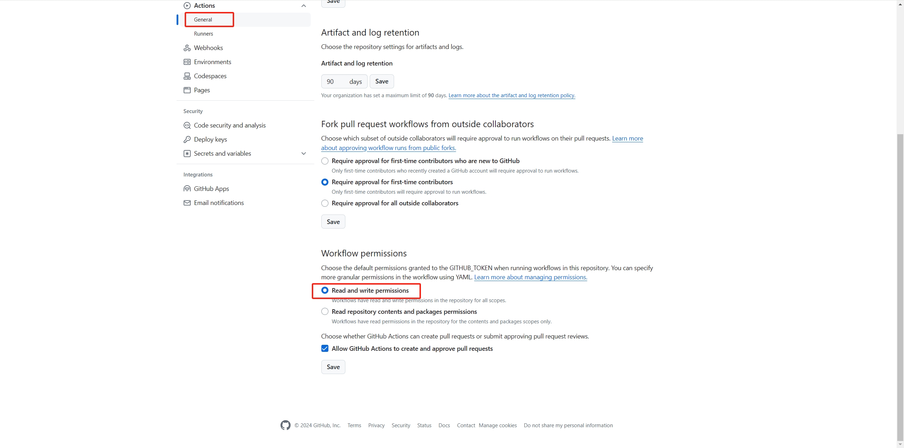

# 🆙 knloop service status

**轻量、开源、零依赖的服务状态监控。**  
- 功能特点  
    - 零依赖，无服务器依赖，纯静态页面。
    - 支持企业微信和wehook 机器人推送。  
    - 支持自建服务部署页面和监控节点。
    - 本地部署可以实现秒级监控。
    - 占用资源少，监控节点仅使在bash环境使用curl。
-  GitHub Actions 运行监控脚本
    - 最低每 5 分钟，workflows可以利用脚本批量访问你需要监控的网站并获得详细信息
    - 手动或者在有新的页面变化的时候才部署GitHub Pages
    - 当开启通知功能，当服务状态不可用时，会推送到企业微信或调用指定的webhook。
- GitHub Pages 发布静态页面
    - 简洁、美观自适应页面，支持 PWA
    - 零依赖，无需任何构建工具
    - 使用 GitHub RWA 从仓库访问最新数据


## 👀 查看效果

在线演示 : [status.knloop.com](https://status.knloop.com)

截图展示 :


## ⚙️ 部署说明

## 方案一、GitHub page + GitHub Actions 最简单方式部署（推荐）
### 1. [Fork](https://github.com/shadowqcom/knloop-service-status/fork) 本项目 [knloop service status](https://github.com/shadowqcom/knloop-service-status/fork).

### 2. 按照下面格式修改 `urls.cfg` 文件中的内容。

```cfg
Web=https://knloop.com
Google=https://google.com
```

### 3. 修改个性化信息

```html

<span>knloop sta</span>
<span class="hero-title is-revealing"> knloop service status </span>
```

### 4. 修改全局配置参数(可选)

`./src/js/index.js`

```js
// 配置参数
export const maxDays = 60;                 // 日志最大展示天数
export const maxHour = 12;                 // 报表最大小时数
export const urlspath = "/src/urls.cfg";  // 配置文件路径,不带后/
export const logspath = "./page/logs";          // 日志文件路径,不带后/
export const reloadReportsdata = true;     // 是否重新加载报告
export const reloadReportstime = 2.5;        // 重载报告的检测间隔时间
```
进阶操作：可以把logspath设置为 `https://raw.githubusercontent.com/用户名/仓库名/分支名/logs` 这样可以访问仓库内最新的log文件，而无需等待重新部署页面。弊端就是raw.githubusercontent.com域名在大陆地区访问质量不高。  

### 5. 配置 GitHub Pages 和 actions权限

- 转到 `settings --> pages` ，

- `Build and deployment` 设置为 Deploy from a branch ，

- `Branch` 设置为 main,

- `Custom domain` 配置你的自定义域名，

- `Enforce HTTPS` 强制https 建议勾选上。

除此之外 还需要配置 actions 对仓库的读写权限，否则检测的结果无法写回仓库。
- 转到 `settings --> actions ---> General` ，
- `Workflow permissions` 设置为 Read and write permissions .  



进阶操作：由于每次提交日志都会触发页面部署，造成不必要的免费额度浪费，所以增加了一个 `deploy-status-pages.yml`文件 可以手动触发 也可以通过提交触发，根据需求灵活配置。
关于GitHub actions的相关配置就不多阐述，请参考官方文件。

### 6. 配置自动任务
修改 `service-status-check.yml` 里面的相关配置
```conf
- cron: "*/25 * * * *"  # 定时任务间隔
ref: page  # 默认分支，一般填main
git push origin page  # 提交到哪个分支，一般也是main
```
然后就是git信息修改，user.name之类的 按照自己的需求修改。  

### 7. 配置 WECHAT_WEBHOOK_KEY （可选）

用作推送失败的url到企业微信机器人。

- 转到 `settings --> Secrets and variables --> Actions` ，
- 新建一个 `Repository secrets` ，
- `Name` 填 `WECHAT_WEBHOOK_KEY` ，
- `Secret` 填写你的企业微信机器人 Webhook地址 key= 后面的值。


## 方案二、自建服务器本地部署
### 1、前置条件
1.1、需要在目标机器上安装git  
1.2、需要配置git密钥,有权限提交仓库。  
1.3、需要支持bash环境，一般Linux发行版都内置了。

### 2、必要的配置
2.1、把 `checkshell/fuse.sh`复制到你个有权限的目录下  
修改fuse.sh里面的仓库地址和分支名为你自己的仓库和默认分支。

2.2、修改在仓库`actions-local.sh`里面的uesr.name和user.email ，最好也修改一下commit的消息。  
2.3、设置自动任务，定时运行`fuse.sh`:

```sh
crontab -e
```

```sh
*/2 * * * * /bin/bash /path/to/fuse.sh > /dev/null 2>&1
```

### 3、发布静态页面
3.1、你仍然可以使用github pages发布静态页面，但需要更加频繁的更新日志文件的话 就会产生过多提交记录，慎用。

3.2、使用nginx部署静态页面, root指向fuse.sh clone下载的本地仓库文件根目录。  
下面试一个简单的例子：
```conf
server {
    listen 80;
    root /path/to/page;
    server_name yourdomain.com;
    location / {
        index index.html;
    }
}
```

## 🛠️ 工作原理

1、默认情况下该项目使用 `GitHub Actions` 根据设定的时间间隔运行 shell 脚本 `servicecheck.sh` ，该脚本读取 `urls.cfg` 配置，使用 curl 测试每个符合要求的 url ，将得到的结果（时间、状态、延迟ms）写入`.log`日志文件。

2、通过 `GitHub Actions` 执行 `git push` 提交到本仓库。 如果你是自己服务器或者本地运行监测脚本，则是在 `actions-local.sh` 中执行 `git push` 。

3、使用 GitHub Pages 发布0依赖、纯html/js实现的静态页面，在 `index.html` 中使用 JavaScript 动态提取日志文件，经过处理和计算后把Uptime和延迟数据报表以易于阅读的方式展示出来。

## ⏱️ 功能规划(TODO)

- [x] 鼠标悬浮展示详情
- [x] 移动端适配
- [x] 在workflows提交log文件
- [x] 企业微信推送（理论上也支持其他Webhook地址）
- [x] 小屏幕可左右滑动状态条
- [x] 展示日志最后更新时间
- [x] 延迟ms数检测
- [x] 延迟曲线图
- [x] 统计图中没有数据的地方显示虚线
- [x] 所有服务当天总体评估状态
- [x] 自动重载报表和日志数据
- [ ] SSL状态检测
- [ ] SSH 检测
- [ ] 钉钉/飞书/邮箱/telegram 通知
- [ ] 邮箱通知

## 🐞 已知问题

- ~~统计图数据可能延迟~~
- ~~统计数据最新的一个小时可能不准确~~
- 手机浏览器打开页面后如果浏览器在后台运行一段时间，重新打开浏览器则报表消失。

## 💡 灵感来自

- [kener](https://github.com/rajnandan1/kener)
- [statuspage](https://github.com/statsig-io/statuspage/)
- [UptimeFlare](https://github.com/lyc8503/UptimeFlare)
- [statusfy](https://github.com/juliomrqz/statusfy)
- [uptime-status](https://github.com/yb/uptime-status)