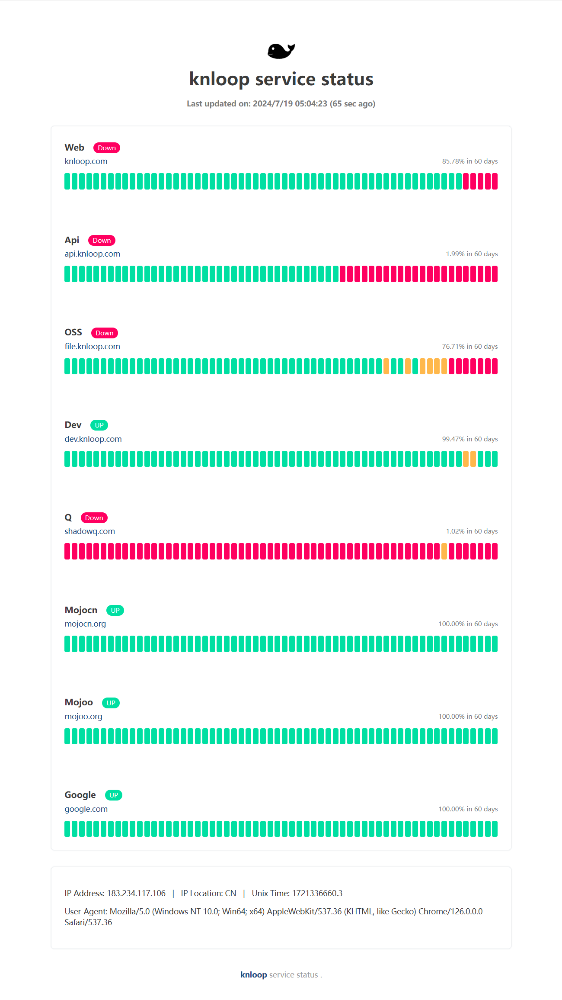

# knloop service status

knloop 相关的服务状态展示

## 查看效果

在线演示 : [status.knloop.com](https://status.knloop.com)


截图展示 :


## 配置说明

### 1. [Fork](https://github.com/shadowqcom/knloop-service-status/fork) 本项目 [knloop service status](https://github.com/shadowqcom/knloop-service-status/fork).
### 2. 按照下面格式修改 `urls.cfg` 文件中的内容。  
  
```cfg
Web=https://knloop.com
Google=https://google.com
```

### 3. 修改 `index.html` 中的title和名称.

```html
<title>knloop status</title>
<span> knloop service status </span>
```
### 4. 替换loge
```html

```

### 5. 配置 GitHub Pages.

如果你使用其他静态页面托管服务则跳过此步骤。  

- 转到 `settings --> pages` ，

- `Build and deployment`  设置为 Deploy from a branch ，

- `Branch`  设置为 main ，

- `Custom domain`  配置你的自定义域名，

- `Enforce HTTPS`  强制https 建议勾选上。

### 6. 配置 WECHAT_WEBHOOK_KEY

本配置可选，用作推送失败的url到企业微信机器人。
- 转到 `settings --> Secrets and variables --> Actions` ，
- 新建一个 `Repository secrets` ，
- `Name` 填 `WECHAT_WEBHOOK_KEY` ，
- `Secret` 填写你的企业微信机器人 Webhook地址 key= 后面的值。


## 工作原理

该项目使用 GitHub Actions 每10分钟唤醒并运行 shell 脚本 `servicecheck.sh` ，该脚本在配置中的每个 url 上运行curl，并将运行结果写入`.log`日志文件然后将其提交到本仓库。  

展示效果使用 GitHub Pages 发布静态页面，0依赖，纯html/js实现。

在`index.html`中动态提取该日志并以易于使用的方式显示。您还可以从自己的基础设施运行该脚本以更频繁地更新状态信息和保存日志数据。


## 功能路线(TODO)
- [x] 悬浮展示详情
- [x] 移动端适配
- [x] 在Actions提交log文件
- [x] 超时自动刷新页面
- [x] 小屏幕可左右滑动状态条
- [ ] SSL 状态检测
- [ ] url延迟检测
- [ ] Incident timeline


## 灵感来自
- [kener](https://github.com/rajnandan1/kener)
- [statuspage](https://github.com/statsig-io/statuspage/)
- [UptimeFlare](https://github.com/lyc8503/UptimeFlare)
