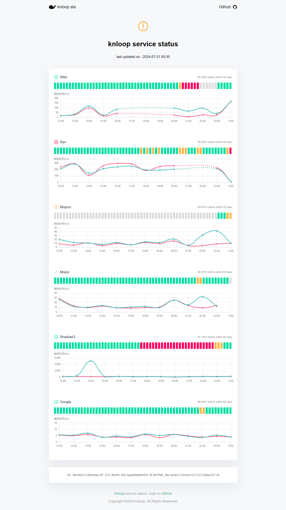

# 🆙 knloop service status

knloop 相关的服务状态展示

## 👀 查看效果

在线演示 : [status.knloop.com](https://status.knloop.com)

截图展示 :


## ⚙️ 配置说明

### 1. [Fork](https://github.com/shadowqcom/knloop-service-status/fork) 本项目 [knloop service status](https://github.com/shadowqcom/knloop-service-status/fork).

### 2. 按照下面格式修改 `urls.cfg` 文件中的内容。

```cfg
Web=https://knloop.com
Google=https://google.com
```

### 3. 修改个性化信息

3.1、 `index.html` 中的title和名称 :

```html
<title>knloop status</title> <span> knloop service status </span>
```

3.2、 替换Logo

```html

```

### 4. 修改显示数据时间范围

4.1、 状态天数范围:

`./src/js/index.js`

```js
const maxDays = 60; // 默认60天，建议不超过90。
```

4.2、 延迟数据报表时间范围:

`./src/js/index.js`

```js
const maxHour = 12; // 默认12小时，建议不超过24。
```

### 5. 设置自动数据刷新
本项设置适用于调用远程logs文件的情况，如果你是使用github pages则跳过此步骤。
`./src/js/index.js`  
```js
export const logspath = "./logs";          // 日志文件路径,不带后/
export const reloadReportsdata = false;     // 是否重新加载报告
export const reloadReportstime = 5;        // 重载报告的检测间隔时间
```
将`logspath`改为你的远程logs文件路径，然后把`reloadReportsdata`设置为true，修改`reloadReportstime`为合适的间隔时间。


### 6. 配置 GitHub Pages.

如果你使用其他静态页面托管服务则跳过此步骤。

- 转到 `settings --> pages` ，

- `Build and deployment` 设置为 Deploy from a branch ，

- `Branch` 设置为 main ，

- `Custom domain` 配置你的自定义域名，

- `Enforce HTTPS` 强制https 建议勾选上。

### 7. 配置 WECHAT_WEBHOOK_KEY

本配置可选，用作推送失败的url到企业微信机器人。

- 转到 `settings --> Secrets and variables --> Actions` ，
- 新建一个 `Repository secrets` ，
- `Name` 填 `WECHAT_WEBHOOK_KEY` ，
- `Secret` 填写你的企业微信机器人 Webhook地址 key= 后面的值。

### 8、在其他机器运行检查脚本

1、需要在目标机器上安装git  
2、需要配置git密钥  
3、把 `checkshell/actions-local.sh`复制到你个有权限的目录下  
4、修改`actions-local.sh`里面的uesr.name和user.email ，最好也修改一下commit的消息。  
5、设置自动任务，定时运行`actions-local.sh`:

```sh
crontab -e
```

```sh
*/2 * * * * /bin/bash /path/to/actions-local.sh > /dev/null 2>&1
```

这样可以每隔2分钟运行一次脚本，可以根据你的机器实际情况设置间隔时间，或者用其他方式触发。

## 🛠️ 工作原理

1、默认情况下该项目使用 `GitHub Actions` 每10分钟运行 shell 脚本 `servicecheck.sh` ，该脚本读取 `urls.cfg` 配置，使用 curl 测试每个符合要求的 url ，将得到的结果（时间、状态、延迟ms）写入`.log`日志文件。

2、通过 `GitHub Actions` 执行 `git push` 提交到本仓库。 如果你是自己服务器或者本地运行监测脚本，则是在 `actions-local.sh` 中执行 `git push` 。

3、使用 GitHub Pages 发布0依赖、纯html/js实现的静态页面，在 `index.html` 中使用 JavaScript 动态提取日志文件，经过处理和计算后把Uptime和延迟数据报表以易于阅读的方式展示出来。

## ⏱️ 功能规划(TODO)

- [x] 鼠标悬浮展示详情
- [x] 移动端适配
- [x] 在workflows提交log文件
- [x] 企业微信推送（理论上也支持其他Webhook地址）
- [x] 小屏幕可左右滑动状态条
- [x] 展示日志最后更新时间
- [x] 延迟ms数检测
- [x] 延迟曲线图
- [x] 统计图中没有数据的地方显示虚线
- [x] 所有服务当天总体评估状态
- [x] 自动重载报表和日志数据
- [ ] SSL状态检测
- [ ] SSH 检测
- [ ] 钉钉/飞书/邮箱/telegram 通知
- [ ] 邮箱通知

## 🐞 已知问题

- ~~统计图数据可能延迟~~
- ~~统计数据最新的一个小时可能不准确~~
- 手机浏览器打开页面后如果浏览器在后台运行一段时间，重新打开浏览器则报表消失。

## 💡 灵感来自

- [kener](https://github.com/rajnandan1/kener)
- [statuspage](https://github.com/statsig-io/statuspage/)
- [UptimeFlare](https://github.com/lyc8503/UptimeFlare)
- [statusfy](https://github.com/juliomrqz/statusfy)
