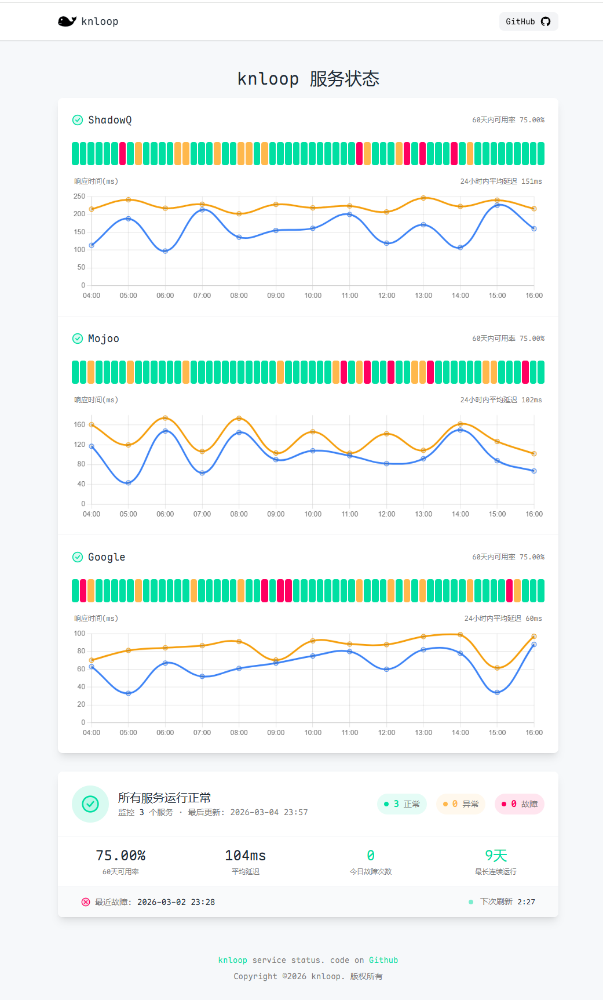
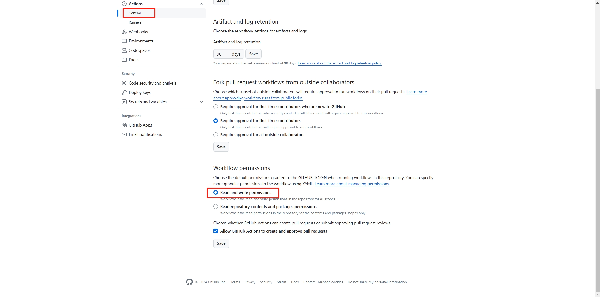

# 🆙 knloop service status

**轻量、开源、零依赖的服务状态监控。**  
- 零依赖，无服务器依赖，纯静态页面。
- 简洁、美观自适应页面
- 零依赖，无需任何构建工具
- 统计图展示中位数和P95数据
- GitHub Actions 运行监控脚本和部署静态页面
- GitHub Pages 发布静态页面


## 👀 查看效果

在线演示 : [status.knloop.com](https://status.knloop.com)

截图展示 :


## ⚙️ 部署说明

## 方案一、GitHub page + GitHub Actions 最简单方式部署（推荐）
### 1. [Fork](https://github.com/shadowqcom/knloop-service-status/fork) 本项目 [knloop service status](https://github.com/shadowqcom/knloop-service-status/fork).

### 2. 按照下面格式修改 `src\config.json` 文件中的内容。

```json
    {
  "maxDays": 60,               // 日志最大展示天数
  "maxHour": 12,               // 报表最大小时数
  "maxLogLines": 10500,        // 最大日志行数
  "logspath": "",              // 日志文件路径
  "reloadReportsdata": true,   // 是否自动重新加载数据
  "reloadReportstime": 2.5,    // 重载报告的检测间隔时间
  "maxRetries": 3,             // 最大重试次数
  "retryDelayMs": 5000,        // 重试延迟时间
  "requestTimeoutMs": 7000,    // 请求超时时间
  "services": [                
    {
      "key": "ShadowQ",           // 服务名称
      "url": "https://www.shadowq.com" // 服务地址
    }
  ]
}

```

可以把logspath设置为 `https://raw.githubusercontent.com/用户名/仓库名/分支名/logs` 这样可以访问仓库内最新的log文件，而无需等待重新部署页面。弊端就是raw.githubusercontent.com域名在大陆地区访问质量不高。  

### 2. 配置 GitHub Pages 和 actions权限

- 转到 `settings --> pages` ，

- `Build and deployment` 设置为 Deploy from a branch ，

- `Branch` 设置为 main,

- `Custom domain` 配置你的自定义域名，

- `Enforce HTTPS` 强制https 建议勾选上。

除此之外 还需要配置 actions 对仓库的读写权限，否则检测的结果无法写回仓库。
- 转到 `settings --> actions ---> General` ，
- `Workflow permissions` 设置为 Read and write permissions .  



 `deploy-status-pages.yml`文件 可以手动触发页面部署，也可以通过提交触发，根据需求灵活配置。
关于GitHub actions的相关配置就不多阐述，请参考官方文件。

### 3. 配置自动任务
修改 `service-status-check.yml` 里面的相关配置
```conf
- cron: "*/25 * * * *"  # 定时任务间隔
ref: page  # 默认分支，一般填main
git push origin page  # 提交到哪个分支，一般也是main
```
然后就是git信息修改，user.name之类的 按照自己的需求修改。  

### 4. 配置 WECHAT_WEBHOOK_KEY （可选）

用作推送失败的url到企业微信机器人。

- 转到 `settings --> Secrets and variables --> Actions` ，
- 新建一个 `Repository secrets` ，
- `Name` 填 `WECHAT_WEBHOOK_KEY` ，
- `Secret` 填写你的企业微信机器人 Webhook地址 key= 后面的值。


## 方案二、自建服务器本地部署
1、可以编译go脚本后本地部署，并开启定时任务，自动检测服务状态 并写入log文件。
2、本项目是纯静态页面，可以直接部署在任意静态文件服务器上，如nginx、apache等。


## 💡 灵感来自

- [kener](https://github.com/rajnandan1/kener)
- [statuspage](https://github.com/statsig-io/statuspage/)
- [UptimeFlare](https://github.com/lyc8503/UptimeFlare)
- [statusfy](https://github.com/juliomrqz/statusfy)
- [uptime-status](https://github.com/yb/uptime-status)